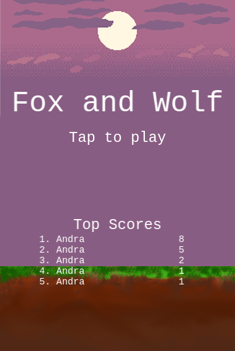
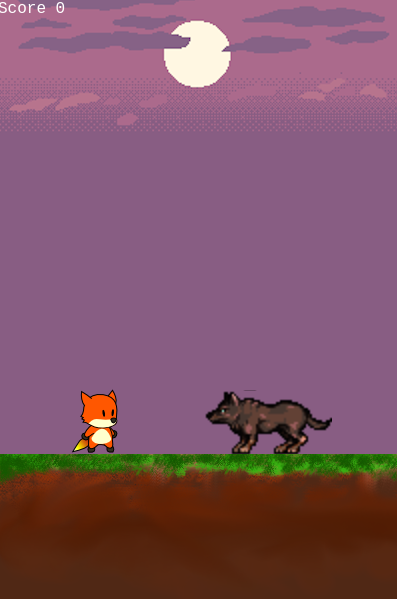

# Fox and Wolf

A very simple game written in [TypeScript](https://www.typescriptlang.org/) with [Line Frontend Framework](https://developers.line.biz/en/docs/liff/overview/) and [Phaser 3](https://phaser.io/).

A submission for [Belajar Membangun LINE Front-end Framework (LIFF)](https://www.dicoding.com/academies/153).

## Screenshot





## Development

LINE require the host URL have HTTPS, so I made a fake SSL for local development.

If you're using Chrome, you have to disable the certificate error.

```
google-chrome-stable --ignore-certificate-errors
```

And then you can run the project with auto compile on change with

```
npm run watch
```

## Build

Just run

```
npm run build
```

And the files in ready on `dist/`

## License

[MIT Licensed](LICENSE)